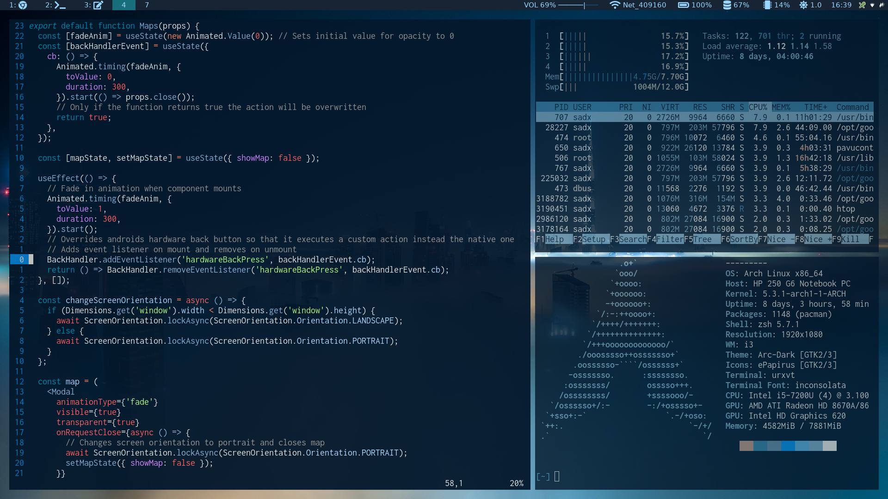
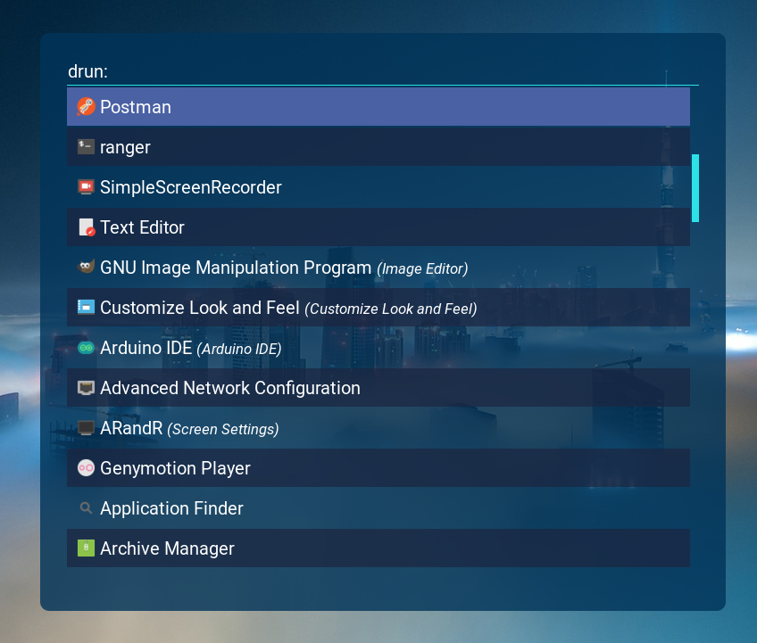

# Linux(Arch) dotfiles

OS: Arch Linux  
WM: i3-gaps  
Launcher: rofi with custom <a href="https://github.com/DKSadx/Nebula-rofi-theme">theme</a>  
Panel: Polybar  
Text Editor: vim  
Vim theme: rigel with pywal generated colors  
Terminal: urxvt  
Shell: zsh  
Compositor: compton  
Font: Inconsolata
